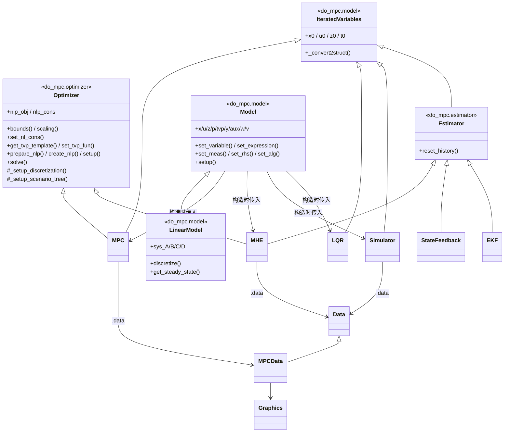
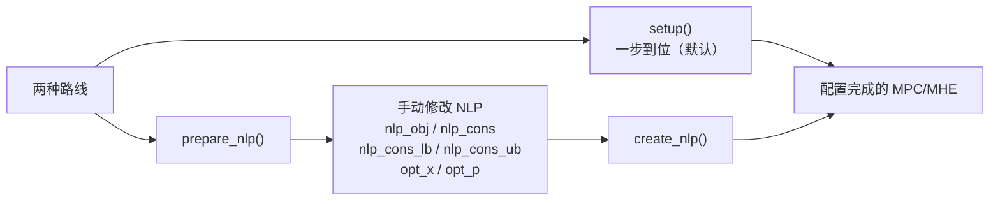

# 02 · 架构与核心概念

本页解释 do-mpc 的设计骨架：**类继承关系、变量类型体系、时间离散化、鲁棒场景树、数据流**。读懂这一页，剩下的 API 就只是查表了。

---

## 一、类继承关系



### 关键设计点

| 基类 | 提供了什么 | 谁继承 |
|---|---|---|
| **`IteratedVariables`**<br/>[`model/_iteratedvariables.py`](../do_mpc/model/_iteratedvariables.py) | `x0` / `u0` / `z0` / `t0` 四个**可按名索引的数值结构体**，以及 `numpy` 数组 ↔ CasADi 结构的自动转换 (`_convert2struct`)。凡是"随时间迭代"的类都需要它。 | `MPC`、`LQR`、`Simulator`、`Estimator`（进而 `MHE`/`EKF`/`StateFeedback`） |
| **`Optimizer`**<br/>[`optimizer.py`](../do_mpc/optimizer.py) | 非线性约束 (`set_nl_cons`)、边界 (`bounds`)、缩放 (`scaling`)、时变参数 (`get_tvp_template`/`set_tvp_fun`)、**正交配置离散化** (`_setup_discretization`)、**场景树构建** (`_setup_scenario_tree`)、NLP 组装与求解 (`prepare_nlp`/`create_nlp`/`setup`/`solve`)、代码生成 (`compile_nlp`)。 | `MPC`、`MHE`（多继承） |
| **`Estimator`**<br/>[`estimator/_base.py`](../do_mpc/estimator/_base.py) | 统一的 `make_step(y0)` 接口 + `reset_history()`。 | `StateFeedback`、`EKF`、`MHE` |
| **`Model`** | 符号变量容器 + 方程注册表。所有派生类都持有一个 `self.model` 引用。 | `LinearModel` |
| **`Data`** | 时间序列存储容器，支持 `data['_x', 'C_a']` 式幂索引（索引的是**变量结构**，时间恒为返回数组第 0 轴）。 | `MPCData`（增加 `prediction()` 查询预测轨迹） |

> **多继承顺序很重要**：`class MPC(do_mpc.optimizer.Optimizer, do_mpc.model.IteratedVariables)`。`Optimizer.__init__` 开头会断言 `'model' in self.__dict__`，所以必须**先**初始化带 `model` 的那个基类。这是扩展 do-mpc 时的第一个坑。

### `flags` 状态机

几乎每个类都有一个 `self.flags` 字典来强制调用顺序，典型的断言消息是 *"Cannot call X after setup()"*：

```python
# Model
{'setup': False}
# Simulator
{'set_tvp_fun': False, 'set_p_fun': False, 'setup': False, 'first_step': True}
# Optimizer (MPC/MHE)
{'prepare_nlp': False, 'setup': False, 'initial_run': False}
```

正确顺序永远是：**配置 → `setup()` → 运行时 `make_step()`**。

---

## 二、`setup()` 的两条路线

`Optimizer` 派生类（MPC / MHE）提供两种完成配置的方式：



- **`setup()`** = `prepare_nlp()` + `create_nlp()`，覆盖 95% 的使用场景。
- **`prepare_nlp()` → 修改 → `create_nlp()`**：深度定制路线。`prepare_nlp` 之后，NLP 的目标函数与约束以 CasADi 符号形式暴露在 `nlp_obj`、`nlp_cons`、`nlp_cons_lb`、`nlp_cons_ub` 属性中，优化变量在 `opt_x`、`opt_p` 中，可以自由追加项，然后再 `create_nlp()` 编译求解器。

> 需要复用/移植 NLP 时还可用 `compile_nlp(overwrite, cname, libname, compiler_command)` 生成 C 代码并编译成共享库。

---

## 三、变量类型体系

这是 do-mpc 最核心的概念。`Model.set_variable(var_type=...)` 的 `var_type` 决定了变量在 MPC / MHE / Simulator 三个场景中的**语义与时序行为**。

| `var_type` | 属性名 | 数学符号 | 含义 | 在预测时域内的行为 | 能否被 MHE 估计 |
|---|---|---|---|---|---|
| `_x` | `model.x` | $x$ | **微分状态** | 每个时刻一个值，序列 | 是（初值） |
| `_u` | `model.u` | $u$ | **控制输入** | 每个时刻一个值，序列 | — |
| `_z` | `model.z` | $z$ | **代数状态**（DAE） | 每个时刻一个值，序列 | — |
| `_p` | `model.p` | $p$ | **（时不变）参数** | **整个时域内恒定**，单值 | ✅ 可（列入 `p_est_list`） |
| `_tvp` | `model.tvp` | $p_{tv}$ | **时变参数** | 每个时刻一个值，序列，**先验已知** | ❌ 否 |
| `_y` | `model.y` | $y$ | **测量输出** | 由 `set_meas` 定义 | — |
| `_aux` | `model.aux` | — | **辅助表达式** | 由 `set_expression` 定义，仅监控/复用 | — |
| `_w` | `model.w` | $w$ | **过程噪声** | 由 `set_rhs(..., process_noise=True)` 自动生成 | ✅（MHE 优化变量） |
| `_v` | `model.v` | $v$ | **测量噪声** | 由 `set_meas(..., meas_noise=True)` 自动生成 | ✅（MHE 优化变量） |

### 模型方程

**连续模型 (`model_type='continuous'`)** —— ODE 或 DAE：

$$
\begin{aligned}
\dot{x}(t) &= f(x,u,z,p,p_{tv}) + w(t) \\
0 &= g(x,u,z,p,p_{tv}) \\
y &= h(x,u,z,p,p_{tv}) + v(t)
\end{aligned}
$$

**离散模型 (`model_type='discrete'`)** —— 差分方程：

$$
\begin{aligned}
x_{k+1} &= f(x_k,u_k,z_k,p_k,p_{tv,k}) + w_k \\
0 &= g(x_k,u_k,z_k,p_k,p_{tv,k}) \\
y_k &= h(x_k,u_k,z_k,p_k,p_{tv,k}) + v_k
\end{aligned}
$$

> 若定义了 `_z` 但没有 `set_alg`，就是纯 ODE；定义了 `set_alg` 就是 DAE。仿真连续 DAE 时，`Simulator` 的 `integration_tool` 必须设为 `'idas'`。

### `_p` 与 `_tvp` 的本质区别（高频困惑点）

| | `_p` 参数 | `_tvp` 时变参数 |
|---|---|---|
| 时域内 | **恒定**（一个标量/向量贯穿整个 horizon） | **逐时刻变化**（一整条序列） |
| 是否先验已知 | 通常未知 → 可被 MHE 估计，可作为鲁棒 MPC 的不确定量 | **必须先验已知**（如天气预报、设定值轨迹） |
| 能否进代价函数 | 一般不（进模型方程） | **常用于代价函数**（如参考轨迹跟踪） |
| 数值供给方式 | `get_p_template()` + `set_p_fun(t_now)` | `get_tvp_template()` + `set_tvp_fun(t_now)` |
| 模板形状 | 单值结构体 | `(n_tvp, n_horizon+1)` 二维结构体 |

**MPC / MHE 的 tvp 模板是二维的**（时域内每个时刻都要给值）：

```python
tvp_template = mpc.get_tvp_template()
def tvp_fun(t_now):
    for k in range(mpc.settings.n_horizon + 1):
        tvp_template['temperature_set_point', k] = 获取第 k 步的设定值
    return tvp_template
mpc.set_tvp_fun(tvp_fun)
```

**Simulator 的 tvp 模板是一维的**（只需要当前时刻的值）：

```python
tvp_template = simulator.get_tvp_template()
def tvp_fun(t_now):
    tvp_template['temperature_external'] = ...
    return tvp_template
simulator.set_tvp_fun(tvp_fun)
```

> **未显式赋值的 tvp 默认为 `0`。** 所以只为控制器引入的设定值 tvp，不必在仿真器的 `tvp_fun` 里设置。
>
> **从仿真器视角看，`_p` 和 `_tvp` 没有区别**（都只是当前时刻的一个数）。区别只在 MPC / MHE 里才有意义。

详细展开见官方 [`FAQ.rst`](../documentation/source/FAQ.rst) 的 "Time-varying parameters" 一节。

---

## 四、SX 还是 MX？

`do_mpc.model.Model(model_type, symvar_type='SX')` 的第二个参数选择 CasADi 符号类型，且**会被所有派生类继承**。

| | `SX`（默认，推荐） | `MX` |
|---|---|---|
| 本质 | 标量表达式图 | 矩阵块表达式图 |
| 适合 | 由**标量运算**构成的模型（绝大多数化工/机械系统） | 含**大规模矩阵-向量乘法**的模型 |
| 内存/速度 | 标量场景下更快、更省 | 矩阵场景下才占优 |
| 功能限制 | 部分 CasADi 高级特性不支持 | 更通用，但 `if/else` 等逻辑需用 CasADi 提供的算子 |

**经验法则**：先用 `SX`。只有当模型里出现大矩阵运算（如降阶模型、大规模网络系统）且性能不达标时，才换 `MX`。

---

## 五、时间离散化：有限元正交配置

MPC / MHE 需要把一个 `t_step` 内的连续动力学变成代数约束。do-mpc 使用**有限元上的正交配置法**（实现见 [`optimizer.py::_setup_discretization`](../do_mpc/optimizer.py)）。

相关设置（MPC 与 MHE 同名同义）：

| 设置 | 默认 | 含义 |
|---|---|---|
| `state_discretization` | `'collocation'` | 目前只支持正交配置 |
| `collocation_type` | `'radau'` | 目前只支持 Radau IIA |
| `collocation_deg` | `2` | 配置多项式阶数 |
| `collocation_ni` | `1` | **每个控制步内**再细分的有限元个数 |

### 一个控制步内部发生了什么

```
t_step
├──── 有限元 1 ────┼──── 有限元 2 ────┤   (collocation_ni = 2)
│  ● deg=2 个配置点 │  ● deg=2 个配置点 │
└─ u 在整个 t_step 内保持恒定 (ZOH) ────┘
```

- **控制输入 `u` 在一个 `t_step` 内恒定**（零阶保持）。
- **状态 `x` 用 `collocation_deg` 阶多项式**在每个有限元内近似，多项式系数由配置点处的 ODE 残差 = 0 决定。
- `collocation_ni > 1` 可以在**不提高多项式阶数**的前提下增加精度 —— 高阶多项式会导致病态的 NLP，这是推荐的替代方案。

### 约束在哪些点上检查？

| 设置 | 默认 | 作用对象 |
|---|---|---|
| `cons_check_colloc_points` | `True` | `bounds` 设置的**线性/盒式**约束 |
| `nl_cons_check_colloc_points` | `False` | `set_nl_cons` 设置的**非线性**约束 |

`True` = 在**每个配置点**都检查（更保守、更安全，问题规模略大）；`False` = 只在**每个有限元边界**检查一次。

> 对离散模型 (`model_type='discrete'`)，这些设置全部无效。

理论推导见 [`theory_orthogonal_collocation.rst`](../documentation/source/theory_orthogonal_collocation.rst)。

---

## 六、鲁棒多阶段 MPC 与场景树

这是 do-mpc 的招牌功能。传统 min-max 鲁棒 MPC 过于保守；**多阶段 MPC (multi-stage MPC)** 通过"场景树"在保留反馈信息的同时控制计算量。

### 核心思想

- 对每个不确定参数声明若干可能取值（如 `alpha ∈ {0.95, 1.0, 1.05}`）。
- 所有参数组合构成若干**场景 (scenario)**，同时预测并优化多条轨迹。
- **关键约束**：在共享同一"历史信息"的时刻，不同场景必须使用**相同的控制输入**（这就是"反馈"的体现）。
- `n_robust` 决定树在前多少步分叉；之后所有场景**合并成一条名义轨迹**，从而避免问题规模指数爆炸。

### `n_robust` 与规模

源码 [`_setup_scenario_tree`](../do_mpc/optimizer.py) 中的规模公式：

```python
n_branches  = [n_combinations if k < n_robust else 1 for k in range(n_horizon)]
n_scenarios = [n_combinations ** min(k, n_robust) for k in range(n_horizon + 1)]
```

- `n_combinations` = 不确定参数取值的**笛卡尔积**大小（上例 3×3 = 9）。
- `n_robust = 0` → 退化为**名义 MPC**（只有 1 个场景）。
- `n_robust = 1` → 第 1 步分叉成 `n_combinations` 条，之后全部合并。**规模线性增长，性价比最高，也是官方示例的默认选择。**
- `n_robust = 2` → 前两步分叉，规模为 `n_combinations²`。
- ⚠️ **问题规模随 `n_robust` 指数增长**，源码 docstring 明确警告了这一点。

场景树结构可视化：[`documentation/source/scenario_tree.png`](../documentation/source/scenario_tree.png)

### 两套 API

**高层 API（推荐）**：直接给出不确定取值，do-mpc 自动取笛卡尔积。

```python
mpc.set_uncertainty_values(alpha=np.array([1., 1.05, 0.95]),
                           beta =np.array([1., 1.1 , 0.9 ]))
```

**低层 API**：完全自定义每个场景的参数组合（可打破笛卡尔积，大幅减小规模）。

```python
p_template = mpc.get_p_template(n_combinations)   # 形状 (n_combinations, ...)
def p_fun(t_now):
    p_template['alpha', 0] = 1.0;  p_template['beta', 0] = 1.0    # 名义
    p_template['alpha', 1] = 1.05; p_template['beta', 1] = 1.0    # 只变 alpha
    p_template['alpha', 2] = 0.95; p_template['beta', 2] = 1.0
    return p_template
mpc.set_p_fun(p_fun)
```

### `open_loop` 设置

| 值 | 行为 |
|---|---|
| `False`（默认） | 每个时刻、每个场景都有**独立**的控制输入 → 真正的反馈鲁棒控制 |
| `True` | 所有场景**共用**同一控制输入 → 开环鲁棒，问题更小但更保守 |

---

## 七、数据流与 `make_step` 契约

### 三个 `make_step` 的输入输出

| 类 | 签名 | 输入 | 输出 |
|---|---|---|---|
| `MPC` | `make_step(x0)` | 当前状态估计 $x_0$ | 最优控制序列的**第一步** $u_0$ |
| `Simulator` | `make_step(u0=None, v0=None, w0=None)` | 控制输入；可选的测量噪声 $v$、过程噪声 $w$ 采样值 | 下一步的**测量值** $y_{next}$ |
| `StateFeedback` | `make_step(y0)` | 测量值 | 直接返回测量值（假设全状态可测） |
| `EKF` | `make_step(y_next, u_next, Q_k, R_k)` | 测量、输入、过程噪声协方差、测量噪声协方差 | 状态估计 |
| `MHE` | `make_step(y0)` | 最新测量值（历史测量由 `set_y_fun` 提供） | 状态估计（+ 参数估计） |
| `LQR` | `make_step(x0)` | 当前状态 | 最优控制输入 |

> **注意**：`Simulator.make_step` 传入的 `v0` / `w0` 必须是**已按模型中噪声变量维度采样好的数值**，do-mpc 不会替你生成随机数。

### 数据是怎么被记录的

每次 `make_step` 内部都会调用 `self.data.update(...)`，把当前时刻的数值追加进 `Data` 对象：

```
mpc.data       ← MPCData  (含 _x, _u, _z, _aux, _tvp, _p, 以及完整预测轨迹 opt_x)
simulator.data ← Data     (含 _x, _u, _z, _y, _aux, _tvp, _p, _w, _v)
mhe.data       ← Data     (含 _x, _u, _z, _y, _p_est, ...)
```

索引方式（`Data.__getitem__`）：

```python
mpc.data['_x', 'C_a']              # 全部时刻的 C_a → 形状 (n_t, 1, 1)
mpc.data['_x', 'C_a'][-1]          # 最后一个时刻的 C_a（时间是返回数组的第 0 轴）
mpc.data['_x', 'Temperature', :2]  # 向量变量的前 2 个分量
mpc.data['_aux', 'T_dif']          # 辅助表达式同样可查
mpc.data['_time']                  # 时间轴本身
mpc.data['t_wall_total']           # 求解耗时（solver stats）
```

> ⚠️ **幂索引里没有"时间"这一维。** `data[...]` 的第一个元素是字段名（`_x`/`_u`/`_z`/`_aux`/`_tvp`/`_p`/`_y`），
> 其后的元素全部用于索引**变量结构**（变量名、向量/矩阵分量）。
> 时间**始终**是返回数组的第 0 轴，用普通 numpy 切片访问：`data['_x','C_a'][10:20]`。
> 写成 `data['_x', :, 'C_a']` 会抛
> `Error occured in struct context with powerIndex (slice(None,None,None), 'p')`。
>
> 唯一带时间参数的查询是 `MPCData.prediction(ind, t_ind)`，它的时间索引是**独立的关键字参数**。

预测轨迹查询（仅 `MPCData`）：

```python
# 在时刻 t_ind 处，对变量 ('_x','C_a') 的整条预测轨迹
mpc.data.prediction(('_x','C_a'), t_ind=10)
```

> ⚠️ **鲁棒多阶段 MPC 下，`MPCData` 默认只存名义参数对应的轨迹。** 要拿到全部场景需要 `store_full_solution=True` 且直接访问 `opt_x`。

### 存储与后处理

```python
# 保存（默认写入 ./results/<name>.pkl；重名会自动加序号前缀，除非 overwrite=True）
do_mpc.data.save_results([mpc, simulator, estimator], 'my_run')

# 读取
res = do_mpc.data.load_results('./results/my_run.pkl')
# res 是字典，键为 'mpc' / 'simulator' / 'estimator'，值为对应的 Data 对象
graphics = do_mpc.graphics.Graphics(res['mpc'])
```

`save_results` 只接受 `MPC` / `Simulator` / (`StateFeedback`|`EKF`|`MHE`) 三类对象，其他类型会抛异常。

---

## 八、缩放 (scaling) 为什么重要

IPOPT 对变量量级极其敏感。CSTR 例子里温度是 `~130`，浓度是 `~0.5`，热流是 `~-8500`，跨越 5 个数量级 —— 不缩放几乎必然导致收敛缓慢或失败。

```python
mpc.scaling['_x', 'T_R']   = 100     # 内部用 x/100 参与优化
mpc.scaling['_u', 'Q_dot'] = 2000
```

- `scaling` 是 `Optimizer` 的 `IndexedProperty`，**读写双向**（`mpc.scaling['_x','T_R']` 可直接取值）。
- 默认全为 `1.0`。
- `Simulator` 也有 `scaling`，但**只作用于 `_x` 和 `_z`**（因为积分期间 `u` 和 `p` 恒定，无需缩放）。
- **经验法则**：让缩放后的变量典型值落在 `[0.1, 10]` 区间。

---

## 九、软约束与松弛变量

`set_nl_cons` 支持把硬约束变成软约束，避免不可行：

$$
\begin{aligned}
m(x,u,z,p_{tv},p) - \epsilon &\le m_{ub} \\
0 \le \epsilon &\le \epsilon_{max}
\end{aligned}
\qquad\text{代价中追加}\qquad \text{penalty}\cdot\|\epsilon\|^2
$$

```python
mpc.set_nl_cons('T_R', model.x['T_R'], ub=140,
                soft_constraint=True,
                penalty_term_cons=1e2,      # 惩罚权重，建议取大值
                maximum_violation=np.inf)   # ε 上界
```

相关设置：

| 设置 | 默认 | 含义 |
|---|---|---|
| `nl_cons_single_slack` | `False` | `True` = **整个时域只用一个**松弛变量（问题更小，但违反会集中在一点）；`False` = 每个时刻一个松弛变量 |

> MHE 也支持同样的机制。经济型 MPC 常常让轨迹贴着约束跑，此时软约束几乎是必需的。

---

## 十、CasADi 兼容层

[`do_mpc/_casadi_compat.py`](../do_mpc/_casadi_compat.py) 是一个不太起眼但很关键的模块。CasADi 3.8.0 引入了两处**破坏性变更**：

1. `casadi.tools` 不再重新导出 `casadi` 命名空间（此前 `from casadi import *` 泄漏进了 `casadi.tools`），而 do-mpc 大量使用 `castools.SX`、`castools.DM`；
2. `casadi.tools.structure3` 被重命名为 `casadi.tools.structure`。第 2 点还会**破坏所有旧版 `.pkl` 结果文件的反序列化**，因为 pickle 里记录了模块路径 `casadi.tools.structure3`。

兼容层的做法：把 3.8 之前的接口在 `castools` 这个名字下复原，并向 `sys.modules` 注册旧模块路径，使老的 `.pkl` 依然可读。所有内部模块统一改为：

```python
from ._casadi_compat import castools      # 而不是 import casadi.tools as castools
```

> ⚠️ **单向兼容**：用 CasADi 3.8 写出的 pickle **无法**在 CasADi ≤ 3.7 上读取 —— CasADi 自身的 `Function` 二进制序列化有版本门禁。对应的回归测试是 [`testing/test_casadi_compat.py`](../testing/test_casadi_compat.py)。

---

## 十一、概念对照速查

| 你想做的事 | do-mpc 里对应什么 |
|---|---|
| 写系统方程 | `Model.set_rhs` / `Model.set_alg` |
| 加一个中间计算量并在图上看到它 | `Model.set_expression`（→ `_aux`） |
| 定义传感器方程 | `Model.set_meas`（→ `_y`，默认带噪声 `_v`） |
| 让参考轨迹随时间变化 | `_tvp` + `set_tvp_fun` |
| 让某个物理常数可被辨识 | `_p` + `MHE(model, p_est_list=[...])` |
| 表达"这个参数我不确定" | `_p` + `mpc.set_uncertainty_values(...)` |
| 加一个不等式约束 | `mpc.set_nl_cons(name, expr, ub=...)` |
| 加一个盒式约束 | `mpc.bounds['lower'/'upper', '_x'/'_u'/'_z', name] = value` |
| 加终端约束 | `mpc.terminal_bounds[...] = value` + `settings.use_terminal_bounds = True` |
| 惩罚输入抖动 | `mpc.set_rterm(u_name=weight)` |
| 经济型目标（非二次型） | `mpc.set_objective(lterm=<任意表达式>, mterm=<任意表达式>)` |
| 完全重写 NLP | `prepare_nlp()` → 改 `nlp_obj`/`nlp_cons` → `create_nlp()` |
