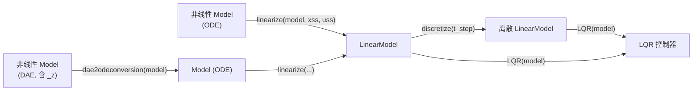
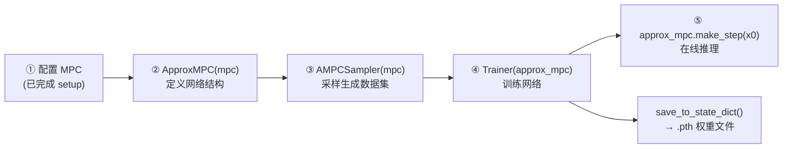
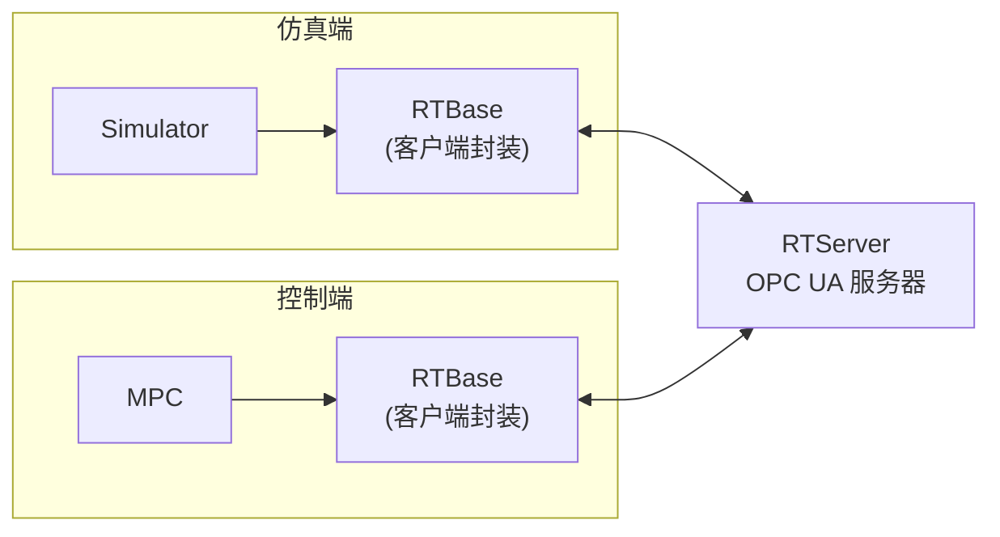

# 05 · 进阶功能

do-mpc 除了核心的 MPC / MHE 闭环之外，还提供了一整套周边工具链。本页逐个介绍。

---

## 目录

| 功能 | 模块 | 额外依赖 | 成熟度 |
|---|---|---|---|
| [鲁棒多阶段 MPC](#一鲁棒多阶段-mpc) | `do_mpc.controller.MPC` | — | 稳定（招牌功能） |
| [LQR + 模型线性化 + DAE→ODE](#二lqr--模型线性化--daeode-转换) | `do_mpc.controller.LQR`, `do_mpc.model` | — | 稳定 |
| [NLP 参数灵敏度微分](#三nlp-参数灵敏度微分) | `do_mpc.differentiator` | — | ⚠️ 实验性 |
| [神经网络近似 MPC](#四神经网络近似-mpc) | `do_mpc.approximateMPC` | `torch` | v4.6.0+ |
| [通用采样框架](#五通用采样框架) | `do_mpc.sampling` | — | 稳定 |
| [ONNX → CasADi 转换](#六onnx--casadi-转换) | `do_mpc.sysid` | `onnx` | ⚠️ 实验性（已支持循环网络 Cell，见 [09](09-循环网络与自定义算子扩展.md)） |
| [OPC UA 实时接口](#七opc-ua-实时接口) | `do_mpc.opcua` | `asyncua` | 稳定（⚠️ 不支持 MHE） |
| [LSTM / GRU 等循环网络](09-循环网络与自定义算子扩展.md) | `do_mpc.sysid` + `do_mpc.model` | `onnx`（仅路径 B） | ✅ 已验证 |
| [NLP 代码生成](#八nlp-代码生成与部署) | `Optimizer.compile_nlp` | C 编译器 | 稳定 |

---

## 一、鲁棒多阶段 MPC

原理已在 [02 · 架构与核心概念 § 六](02-架构与核心概念.md#六鲁棒多阶段-mpc-与场景树) 详述。这里给出实操要点。

### 完整配方

```python
# ① 模型里把不确定的量声明为 _p
model = do_mpc.model.Model('continuous')
alpha = model.set_variable('_p', 'alpha')
beta  = model.set_variable('_p', 'beta')
# ... set_rhs 中引用 alpha / beta ...
model.setup()

# ② MPC 里声明不确定集合 + 鲁棒时域
mpc = do_mpc.controller.MPC(model)
mpc.settings.n_horizon = 20
mpc.settings.n_robust  = 1          # ★ 0 = 名义 MPC，1 = 最常用
mpc.settings.open_loop = False      # 每个场景独立输入（真反馈）
mpc.set_uncertainty_values(alpha=np.array([1., 1.05, 0.95]),
                           beta =np.array([1., 1.1 , 0.9 ]))
mpc.setup()

# ③ 仿真器里给出"真实"参数值（刻意不同于 MPC 认知）
p_num = simulator.get_p_template()
p_num['alpha'] = 1.07               # 真实世界
p_num['beta']  = 0.93
simulator.set_p_fun(lambda t: p_num)
```

### 规模估算与调优

设 `n_p` 个不确定参数各取 `m_i` 个值，则 `n_combinations = ∏ m_i`。

| `n_robust` | 时域内最大场景数 | 优化变量量级 | 建议 |
|---|---|---|---|
| `0` | 1 | $O(N)$ | 名义 MPC |
| `1` | `n_combinations` | $O(N \cdot n_c)$ | ✅ **首选**，鲁棒性收益最大 |
| `2` | `n_combinations²` | $O(N \cdot n_c^2)$ | 小规模问题可试 |
| `≥3` | `n_combinations³⁺` | 指数爆炸 | ⚠️ 除非 `n_combinations` 很小 |

**减小规模的技巧：**

1. **减少每个参数的取值数**：从 5 个减到 3 个（下界/名义/上界）通常已足够。
2. **用低层 API 打破笛卡尔积**：只考虑"一次只有一个参数偏离"的组合，把 `n_combinations` 从 $\prod m_i$ 降到 $\sum (m_i - 1) + 1$。
   ```python
   p_template = mpc.get_p_template(5)     # 手工指定组合数，而不是 3×3=9
   def p_fun(t_now):
       p_template['alpha', :] = 1.0; p_template['beta', :] = 1.0   # 全部先设名义
       p_template['alpha', 1] = 1.05; p_template['alpha', 2] = 0.95
       p_template['beta',  3] = 1.1 ; p_template['beta',  4] = 0.9
       return p_template
   mpc.set_p_fun(p_fun)
   ```
3. **`open_loop=True`**：所有场景共用输入，规模最小，但保守性最强。
4. **缩短 `n_horizon`** 或 **降低 `collocation_deg`**。
5. **`set_linear_solver('MA27')`**：多阶段 MPC 的 KKT 系统稀疏结构特殊，换线性求解器收益尤其明显。

### 完整示例

[`examples/CSTR/`](../examples/CSTR) — `n_robust=1`，`alpha` 3 值 × `beta` 3 值 = 9 场景，含软约束温度上限。

---

## 二、LQR + 模型线性化 + DAE→ODE 转换

do-mpc 的 LQR 走一条"非线性模型 → 线性模型 → LQR"的工具链。



### 路线 A：非线性 ODE → LQR

```python
model = template_model()                      # 已 setup 的非线性 Model
model_dc = model.discretize(t_sample)         # 或先 linearize 再 discretize

lqr = do_mpc.controller.LQR(model_dc)
lqr.settings.t_step    = 0.5
lqr.settings.n_horizon = 10                   # None = 无限时域

lqr.set_objective(Q=10*np.eye(4), R=np.diag([1e-1, 1e-5]))
lqr.set_rterm(delR=np.diag([1e8, 1]))         # 可选：输入增量惩罚模式
lqr.set_setpoint(xss=..., uss=...)            # 可选，默认 0
lqr.setup()

u0 = lqr.make_step(x0)
```

参考：[`examples/lqr_examples/CSTR_lqr/`](../examples/lqr_examples/CSTR_lqr)

### 路线 B：非线性模型 → 线性化 → LQR

```python
model = template_model()                      # 非线性，无 _z
lin_model = do_mpc.model.linearize(model, xss=x_steady, uss=u_steady)
# lin_model 是增量形式：Δẋ = A Δx + B Δu，新增输入 q 代表 u̇

lqr = do_mpc.controller.LQR(lin_model.discretize(0.5))
...
```

⚠️ **增量形式的陷阱**：`linearize` 返回的模型变量是 $\Delta x$、$\Delta u$。LQR 解出的是 $u$ 与 $x$ 本身，要得到增量需**自行减去设定值**。

### 路线 C：DAE → ODE → 线性化 → LQR

```python
dae_model = template_model()                          # 含 _z 与 set_alg
ode_model = do_mpc.model.dae2odeconversion(dae_model) # index-1 DAE 专用
# 新状态 = [x, u, z]，新输入 = q (= u̇)
lin_model = do_mpc.model.linearize(ode_model, xss=..., uss=...)
lqr = do_mpc.controller.LQR(lin_model)
```

⚠️ **只支持 index-1 DAE**；高指标 DAE 无法用此方法转换。
⚠️ 转换后的模型**已经是增量输入形式**，因此**不要再调 `set_rterm`**（源码明确不推荐）。

参考：[`examples/lqr_examples/batch_reactor_lqr_dae/`](../examples/lqr_examples/batch_reactor_lqr_dae)、[`examples/lqr_examples/oscillating_masses_discrete_lqr/`](../examples/lqr_examples/oscillating_masses_discrete_lqr)

### `LinearModel` 的直接构造

如果本来就有 $(A,B,C,D)$，可以跳过线性化：

```python
lin = do_mpc.model.LinearModel('discrete')
x = lin.set_variable('_x', 'x', shape=(4,1))
u = lin.set_variable('_u', 'u', shape=(1,1))
lin.setup(A=A, B=B, C=C, D=D)      # 直接传矩阵
```

或者用方程形式：`lin.set_rhs('x', A@x + B@u)` → `lin.setup()`。

---

## 三、NLP 参数灵敏度微分

> ⚠️ **实验性功能，源码明确声明 "The API might change in the future"。**

模块：[`do_mpc/differentiator/`](../do_mpc/differentiator) · 导出：`NLPDifferentiator`, `DoMPCDifferentiator`, `helper`

### 能解决什么问题

MPC 每步求解一个参数化 NLP，其最优解 $z^*(p)$ 是参数 $p$ 的隐函数。**灵敏度微分**给出 $\partial z^*/\partial p$，用途：

- 计算 $\partial u_0 / \partial x_0$ —— 显式 MPC 的局部线性近似
- 计算 $\partial u_0 / \partial u_{prev}$ —— 分析输入增量惩罚的实际效果
- 灵敏度基的鲁棒控制、微分式 MPC、把 MPC 嵌入更大的可微分流程（如 PyTorch 训练循环）
- 诊断：LICQ / 严格互补性 / KKT 残差检查

### 两个类

| 类 | 用途 |
|---|---|
| **`NLPDifferentiator(nlp, nlp_bounds)`** | **通用**，可脱离 do-mpc 独立使用任何 CasADi NLP |
| **`DoMPCDifferentiator(optimizer)`** | do-mpc 专用，继承上者。传入 `MPC` 或 `MHE` 对象，自动抽取 NLP，重写 `differentiate()` |

### `DoMPCDifferentiator` 六步用法

```python
# ① 正常配置并 setup 一个 MPC
mpc = template_mpc(model); mpc.setup()

# ② 创建微分器
nlp_diff = do_mpc.differentiator.DoMPCDifferentiator(mpc)

# ③ （可选）配置
nlp_diff.settings.check_LICQ = False       # 关掉耗时的诊断
nlp_diff.settings.linear_solver = 'casadi'

# ④ 正常求解一次 MPC
mpc.make_step(x0)

# ⑤ 在当前最优点计算参数灵敏度
dx_dp_num, dlam_dp_num = nlp_diff.differentiate()
#    参数与最优解自动从 mpc 对象读取，无需传参

# ⑥ 用幂索引取出关心的那一段
from casadi.tools import indexf
du0_dx0      = nlp_diff.sens_num['dxdp', indexf['_u', 0, 0], indexf['_x0']]
du0_du_prev  = nlp_diff.sens_num['dxdp', indexf['_u', 0, 0], indexf['_u_prev']].full()
```

`sens_num` 的幂索引结构：`['dxdp', <目标变量索引>, <参数索引>]`。可用的索引来自 `mpc.opt_x` / `mpc.opt_p` 的结构。

### 通用 `NLPDifferentiator` 用法

```python
import casadi as ca
nlp = {'x': x, 'p': p, 'f': cost, 'g': cons}
nlp_bounds = {'lbx': ..., 'ubx': ..., 'lbg': ..., 'ubg': ...}

solver   = ca.nlpsol('solver', 'ipopt', nlp)
nlp_diff = do_mpc.differentiator.NLPDifferentiator(nlp, nlp_bounds)

r = solver(p=p0, **nlp_bounds)                       # 先求解
dxdp, dlamdp = nlp_diff.differentiate(r, p0)         # 再微分（需显式传解与参数）
```

### 诊断状态

```python
st = nlp_diff.status
print(st.LICQ, st.SC, st.lse_solved, st.full_rank)
print(st.residuals)          # KKT 残差
```

若 `LICQ=False` 或 `SC=False`，灵敏度在数学上**不存在或不唯一** —— 这通常意味着约束冗余或退化，是灵敏度结果不可信的信号。

> ✅ `lin_solver` 的三个取值 `'casadi'` / `'scipy'` / `'lstsq'` 现已被 [`testing/test_differentiator.py`](../testing/test_differentiator.py) 覆盖，并与**重新求解 NLP 得到的中心差分**对拍（三者一致到 `9.04e-09`）。
> 其中 `'scipy'` 路径原先有一个缺陷：`scipy.sparse.linalg.spsolve` 在**单列右端项**（即 `n_p == 1`，非常常见）时会塌缩成一维 `ndarray`，导致下游 `_map_dxdp` 抛 `IndexError: too many indices for array`。已修正为统一归一化到 `(n_z, n_p)`。

### 示例

- [`examples/batch_reactor_differentiator/`](../examples/batch_reactor_differentiator) — 完整闭环 + 灵敏度
- [`examples/tools/nlpdifferentiator/demo_nlp_differentiator.py`](../examples/tools/nlpdifferentiator/demo_nlp_differentiator.py) — 通用 NLP 微分
- [`examples/tools/nlpdifferentiator/cstr_mpc_differentiater.py`](../examples/tools/nlpdifferentiator/cstr_mpc_differentiater.py) — CSTR MPC 微分

---

## 四、神经网络近似 MPC

模块：[`do_mpc/approximateMPC/`](../do_mpc/approximateMPC) · **需要 `torch`**（`pip install do-mpc[full]`）· v4.6.0+

导出：`ApproxMPC`, `AMPCSampler`, `Trainer`, `FeedforwardNN`, `ApproximateMPCSettings`

### 为什么需要它

在线 MPC 每步要解一个 NLP，对**嵌入式 / 毫秒级 / 大规模部署**场景太慢。近似 MPC 的思路：**离线**用大量 MPC 求解结果训练一个神经网络，**在线**只做一次前向传播。



### 完整流程（改编自 [`examples/CSTR_approximate_mpc/main.py`](../examples/CSTR_approximate_mpc/main.py)）

```python
from do_mpc.approximateMPC import ApproxMPC, AMPCSampler, Trainer

# ── ① 照常配置 MPC ──
mpc = template_mpc(model, silence_solver=True)
mpc.x0 = x0; mpc.u0 = u0
mpc.set_initial_guess()

# ── ② 定义近似网络 ──
approx_mpc = ApproxMPC(mpc)
approx_mpc.settings.n_hidden_layers = 1
approx_mpc.settings.n_neurons       = 50
approx_mpc.setup()                     # 构建网络 + 从 mpc 继承 bounds 用于归一化

# ── ③ 采样 ──
sampler = AMPCSampler(mpc)
sampler.settings.closed_loop_flag  = True    # 闭环采样（更贴近实际运行分布）
sampler.settings.trajectory_length = 1
sampler.settings.n_samples         = 10000
sampler.settings.dataset_name      = 'my_dataset'
sampler.setup()
np.random.seed(42)                           # 保证可复现
sampler.default_sampling()                   # 数据写入 ./sampling/

# ── ④ 训练 ──
trainer = Trainer(approx_mpc)
trainer.settings.dataset_name   = 'my_dataset'
trainer.settings.n_epochs       = 3000
trainer.settings.scheduler_flag = True
trainer.settings.show_fig = trainer.settings.save_fig = trainer.settings.save_history = True
trainer.scheduler_settings.cooldown = 0
trainer.scheduler_settings.patience = 50
trainer.setup()
trainer.default_training()                   # 权重写入 ./training/

# ── ⑤ 在线推理 ──
u0 = approx_mpc.make_step(x0, u_prev=None, clip_to_bounds=True)
```

### `ApproxMPC` 主要方法

| 方法 | 说明 |
|---|---|
| `setup()` | 构建 `FeedforwardNN` 并从 MPC 继承上下界 |
| `make_step(x0, u_prev=None, clip_to_bounds=True)` | ★ 在线推理，接口与 `MPC.make_step` 对齐。`clip_to_bounds=True` 会把输出裁剪到输入约束内 |
| `predict(x_batch)` | 批量前向传播（`torch.no_grad`） |
| `forward(x)` | PyTorch 标准前向（含内部归一化） |
| `scale_inputs(x)` / `rescale_outputs(y)` | 归一化 / 反归一化 |
| `clip_control_actions(y)` | 裁剪到 `[lbu, ubu]` |
| `set_shift_values()` | 设置平移量（与 MPC 的 `_u_prev` 机制对应） |
| `save_to_state_dict(directory='approx_mpc.pth')` | 保存权重 |
| `load_from_state_dict(directory='approx_mpc.pth')` | 加载权重 |
| `count_params()` | 统计可训练参数量 |

> `ApproxMPC` 本身是 `torch.nn.Module` 的子类，可以无缝嵌入任何 PyTorch 流程。

### 开环 vs 闭环采样

| | 开环 (`closed_loop_flag=False`) | 闭环 (`closed_loop_flag=True`) |
|---|---|---|
| 状态来源 | 在 `[lbx, ubx]` 内**均匀随机撒点** | 由仿真器积分产生的**真实轨迹** |
| 数据分布 | 覆盖整个可行域，含大量实际不会到达的区域 | 集中在实际运行区域 |
| 需要的额外配置 | 无 | `trajectory_length`；鲁棒 MPC 还需 `lbp`/`ubp`（为仿真器抽参数） |
| 内部方法 | `approx_mpc_open_loop_sampling()` / `approx_mpc_sampling_plan_box()` | `approx_mpc_closed_loop_sampling()` |
| 适用 | 追求全域近似精度 | 追求闭环性能 |

`sampler.simulator_settings` 可单独配置闭环采样时使用的仿真器。

### `Trainer` 输出物

`results_dir`（默认 `./training/`）下会生成：

- `approx_mpc.pth` — 网络权重
- `hyperparameters.json` — 本次训练的完整超参
- `training_history.json` / `training_history.png` — 损失曲线（需 `save_history` / `save_fig`）

参考产物：[`documentation/source/example_gallery/training_notebook/results_my_dataset/`](../documentation/source/example_gallery/training_notebook/results_my_dataset)

### 相关 Notebook

- [`data_generator.ipynb`](../documentation/source/example_gallery/data_generator.ipynb) — 采样
- [`appx_cstr_example.ipynb`](../documentation/source/example_gallery/appx_cstr_example.ipynb) — 完整近似 MPC 流程

---

## 五、通用采样框架

模块：[`do_mpc/sampling/`](../do_mpc/sampling) · 导出：`SamplingPlanner`, `Sampler`, `DataHandler`

这是一个**与 MPC 无关的通用工具**，用于"批量跑参数化实验并做后处理"—— 比如灵敏度研究、蒙特卡洛分析、超参扫描。


三者共享同一个 `sampling_plan`（一个 `List[Dict]`）。

### `SamplingPlanner`

| 方法 | 说明 |
|---|---|
| `set_sampling_var(name, fun_var_pdf=None)` | 注册一个待采样变量及其**取值函数**（无参可调用对象） |
| `gen_sampling_plan(n_samples)` | 生成含 `n_samples` 个 case 的采样计划 |
| `add_sampling_case(**kwargs)` | 手工追加一个指定 case |
| `product(**kwargs)` | 生成多个变量取值的**笛卡尔积**计划 |
| `export(sampling_plan_name)` | 导出计划为 pickle |
| `set_param(**kwargs)` | 批量配置 |
| `data_dir` | 属性 |

```python
sp = do_mpc.sampling.SamplingPlanner()
sp.set_sampling_var('alpha', np.random.randn)
sp.set_sampling_var('beta',  lambda: np.random.randint(0, 5))
plan = sp.gen_sampling_plan(n_samples=10)
```

### `Sampler`

| 方法 | 说明 |
|---|---|
| `set_sample_function(fun)` | ★ 设置采样函数。**其参数名必须与 `set_sampling_var` 的名字一致**（内部用 `inspect.signature` 匹配） |
| `sample_data()` | 执行全部 case，每个 case 写一个文件 |
| `sample_idx(idx)` | 只执行计划中第 `idx` 个 case（便于并行/调试） |
| `set_param(**kwargs)` | 批量配置 |
| `data_dir` | 属性，样本存放目录 |
| `set_post_processing(name, fun)` | 在保存前对结果做加工 |

```python
sampler = do_mpc.sampling.Sampler(plan)
sampler.data_dir = './my_samples/'
sampler.set_sample_function(lambda alpha, beta: alpha * beta)
sampler.sample_data()
```

> 💡 **断点续采**：`Sampler` 默认**跳过 `data_dir` 中已存在的样本**，因此可以安全地重复运行、或用多进程并行跑不同 `idx`。

### `DataHandler`

| 方法 | 说明 |
|---|---|
| `set_param(**kwargs)` | 配置（尤其 `data_dir`） |
| `set_post_processing(name, fun)` | 注册后处理函数，加载每个样本时自动应用 |
| `filter(...)` | 按条件筛选样本 |
| `dh[idx]` | `__getitem__`，按索引取样本 |

### 示例

| 路径 | 内容 |
|---|---|
| [`examples/tools/sampling/regular/test_fun/`](../examples/tools/sampling/regular/test_fun) | 最小示例：采样一个测试函数 |
| [`examples/tools/sampling/regular/closed_loop/`](../examples/tools/sampling/regular/closed_loop) | 采样闭环 MPC 结果 |
| [`examples/tools/sampling/multiprocessing/`](../examples/tools/sampling/multiprocessing) | **多进程并行**采样（`mp_sampling_*_01.py` 生成，`_02.py` 汇总） |
| [`data_generator.ipynb`](../documentation/source/example_gallery/data_generator.ipynb) | Notebook 讲解 |

对应回归测试：[`testing/test_sampling_tools.py`](../testing/test_sampling_tools.py)

---

## 六、ONNX → CasADi 转换

模块：[`do_mpc/sysid/`](../do_mpc/sysid) · **需要 `onnx`** · 导出：`ONNXConversion`, `ONNXOperations`

> ⚠️ **源码标注为实验性功能，支持的算子数量有限。**
>
> 📌 另见 **[09 · 循环网络与自定义算子扩展](09-循环网络与自定义算子扩展.md)**：如何接入 LSTM/GRU，以及如何为 `ONNXOperations` 增加新算子。

### 用途

把在 TensorFlow / PyTorch / Keras 中训练好的神经网络（导出为 ONNX）**符号化**成 CasADi 表达式，从而可以：

- 直接嵌入 `do_mpc.model.Model` 作为系统动力学的一部分（数据驱动建模 / 系统辨识）
- 让 MPC 能够"看穿"神经网络并进行优化与求导

### 推荐：声明式构建器

`do_mpc.sysid.ann_to_dompc_model` 把「导出 → 转置 → 符号替换 → `set_rhs` → `setup`」整套样板封装成一份声明式 spec，并在建模型**之前**校验所有宽度：

```python
model, converter = do_mpc.sysid.ann_to_dompc_model(
    net,                                            # torch.nn.Module / .onnx 路径 / ModelProto
    x_spec  = [('x', 2)], u_spec = [('u', 2)],
    wiring  = [('xu', [('x', 'x'), ('u', 'u')])],   # ONNX 输入 'xu' = [x; u]
    outputs = [(0, 'x')],                           # 图输出 0 驱动状态 'x'
    sample_args=(torch.zeros(1, 4),), input_names=['xu'])
```

实测 **11/11 种架构**（1~50 节点，含前馈 / 残差 / 单层与堆叠 LSTM / GRU）用同一个构建器跑通 `Model → MPC → Simulator → 闭环`。循环网络只需把隐状态写进 `x_spec`。

构建器还支持 `p_spec`（参数，可被 MHE 估计、可作鲁棒 MPC 的不确定量）、`tvp_spec`（时变参数，即参考轨迹 / 预报）、`z_spec` + `algebraic`（**DAE 代理模型**）、`measurements`（`set_meas`，使 **MHE / EKF 可用于 ANN 模型**），以及 `(key, slice)` 形式的**输出切片**和用**任意中间节点名**作键。配套的 `set_constant_parameters` / `set_constant_tvp` 会自动处理 MPC 与 Simulator/MHE/EKF 之间**模板形状不对称**的问题。

详见 [09 § 9.5](09-循环网络与自定义算子扩展.md#95-通用性审计与后续补齐-)。

### 底层五步用法（需要完全掌控时）

```python
import onnx
onnx_model = onnx.load('model.onnx')

# ① 初始化转换器
conv = do_mpc.sysid.ONNXConversion(onnx_model)

# ② 打印模型信息：查看输入名与形状、可查询的节点名
print(conv)

# ③ 转换：用关键字参数传入模型的外部输入
conv.convert(input=np.ones((1,3)))          # 可以传 numpy 数组
# 或传 CasADi 符号（这才是重点）：
x = casadi.SX.sym('x', 1, 3)
conv.convert(input=x)

# ④ 按名字取出任意中间层 / 输出节点的 CasADi 表达式
expr = conv['output']

# ⑤ 嵌入 do-mpc 模型
model.set_rhs('my_state', expr)
```

`print(conv)` 的输出形如：

```
ONNX2Casadi model 'casadi_model'
----------------------------------
Call 'convert' by supplying the inputs with respective name and shape below.
Input shape of 'input' is (1, 3)
----------------------------------
Query the instance with the following keywords to obtain the CasADi expression:
- 'input'
- 'model_4/hidden/MatMul:0'
- 'model_4/hidden/Relu:0'
- 'output'
```

### 支持的算子（`ONNXOperations`）

**共 37 个算子**，全部按 ONNX 规范实现并有测试覆盖（[`testing/test_onnx.py`](../testing/test_onnx.py)，106 个用例）。

| 类别 | 算子 |
|---|---|
| 激活 | `Tanh`, `Sigmoid`, `Relu`, `Elu`, `LeakyRelu`, `Softplus`, `Softmax`, `Clip` |
| 算术 | `Add`, `Sub`, `Mul`, `Div`, `Pow`, `Sqrt`, `Erf`, `Abs`, `Neg`, `Exp`, `Log`, `Sum` |
| 线性代数 | `MatMul`, `Gemm` |
| 归一化 | `BatchNormalization`（推理模式）, `LayerNormalization` |
| 规约 | `ReduceMean`, `ReduceSum` |
| 形状操作 | `Concat`, `Split`, `Transpose`, `Unsqueeze`, `Squeeze`, `Slice`, `Reshape`, `Flatten`, `Shape`, `Identity` |
| 常量 | `Constant` |

> ✅ 已按 ONNX 规范验证的细节包括：`Slice` 的 **opset ≥ 10 输入式**约定（旧实现只认 opset ≤ 9 的属性式，对所有现代导出都崩）、`Concat` 的 `axis` 缺省、`Reshape`/`Flatten` 的**行主序**语义（CasADi 本身是列主序）、以及逐通道参数的 `(C,) → (1,C)` 广播（CasADi 不做 numpy 式广播）。详见 [09 § 四](09-循环网络与自定义算子扩展.md#四已支持的-onnx-算子清单)。
>
> ⚠️ **仍不支持**：`Conv` / `MaxPool` / `AveragePool`（需三维滑窗）、`Gather` / `Expand`、融合的 `LSTM`/`GRU`/`RNN`（三维张量）、控制流算子。
>
> ✅ **循环网络已可支持**：导出 `torch.nn.LSTMCell` / `GRUCell` / `RNNCell`（**不是**序列版 `LSTM`）即可转换成功——Cell 在 ONNX 中无对应算子，会被拆成上表中的原语。
>
> 📊 **实测覆盖**：23 种常见 torch 层/架构中 **21 种可转换**（精度 `3.5e-08` ~ `2.4e-07`），仅 `Conv1d` 与序列 `LSTM` 因需三维被阻断，且都给出指向根因的报错。
>
> ✅ **轴语义已按 ONNX rank 正确解析**：`ONNXConversion` 用 `onnx.shape_inference` 记录每个值（含中间值）的 rank，`convert()` 派发前把偏移交给算子，`_resolve_axis()` 据此换算。详见 [09 § 9.6](09-循环网络与自定义算子扩展.md#96-onnx-rank-追踪轴歧义已彻底修复-)。
> 完整范式、通用性边界与踩坑清单见 **[09 · 循环网络与自定义算子扩展](09-循环网络与自定义算子扩展.md)**。

### PyTorch 权重 → do-mpc 的完整链路

[`examples/tools/pytorch_2_do-mpc/`](../examples/tools/pytorch_2_do-mpc) 演示了这条路：

```
model_weights.pth  →  template_converter.py (PyTorch → ONNX)
                   →  do_mpc.sysid.ONNXConversion (ONNX → CasADi)
                   →  template_model.py (嵌入 Model.set_rhs)
                   →  template_mpc.py + main.py (闭环控制)
```

其他示例：[`examples/tools/onnx_conversion/onnx_conversion_01.py`](../examples/tools/onnx_conversion/onnx_conversion_01.py)（Keras/TF 路线）、[`onnx_conversion_02.py`](../examples/tools/onnx_conversion/onnx_conversion_02.py)

对应 Notebook：[`conversion.ipynb`](../documentation/source/example_gallery/conversion.ipynb)
回归测试：[`testing/test_onnx.py`](../testing/test_onnx.py)

---

## 七、OPC UA 实时接口

模块：[`do_mpc/opcua/`](../do_mpc/opcua) · **需要 `asyncua`** · 导出：`RTBase`, `RTServer`, `RTClient`, `Namespace`, `NamespaceEntry`, `ServerOpts`, `ClientOpts`

> ⚠️ **源码明确声明：`do_mpc.estimator.MHE` 目前不受支持。**

### 用途

把 do-mpc 的 MPC / Simulator 接入 **OPC UA** 工业通信协议，实现与 PLC / DCS / SCADA 的实时数据交换，做硬件在环 (HIL) 或真实装置部署。



### `RTBase(do_mpc_object, clientOpts, namespace=None)`

把一个 do-mpc 对象包装成 OPC UA 客户端。

| 方法 | 说明 |
|---|---|
| `namespace_from_model(model, model_name)` | ★ 从 `Model` 自动生成命名空间（节点 ID 草稿） |
| `get_default_namespace(namespace_name)` | 生成默认命名空间 |
| `connect()` / `disconnect()` | ★ 连接 / 断开服务器 |
| `set_write_tags(tagout)` / `set_read_tags(tagin)` | 复用**另一个** `RTBase` 实例的节点标签（需在服务器端 `namespace_from_client` 之后调用） |
| `write_to_tags(data)` | ★ 写入初值 |
| `read_from_tags()` | 读取当前值 |
| `make_step()` | 执行一次 do-mpc 的 `make_step`（含读标签 → 计算 → 写标签） |
| `async_run()` | 持续异步循环 |
| `async_step_start()` / `async_step_stop()` | ★ 在后台线程中按周期启停 `make_step` |

### `RTServer(opts)`

| 方法 | 说明 |
|---|---|
| `namespace_from_client(client)` | 从某个 `RTClient` 自动构建服务器命名空间 |
| `add_variable_to_node(namespace_entry, namespace_url)` | 手工添加变量节点 |
| `start()` / `stop()` | ★ 启动 / 停止服务器（**务必记得 stop**） |

### `RTClient(opts, namespace)`

底层客户端，一般不直接使用（由 `RTBase` 内部管理）。

| 方法 | 说明 |
|---|---|
| `connect()` / `disconnect()` | 连接管理 |
| `writeData(tag, dataVal)` / `readData(tag)` | 单个标签读写 |
| `add_namespace_url(url)` | 添加命名空间 URL |

### 配置数据类（[`_helper.py`](../do_mpc/opcua/_helper.py)）

| 类 | 字段 |
|---|---|
| `ServerOpts` | 服务器名、IP、端口 |
| `ClientOpts` | 客户端名、目标服务器 IP、端口 |
| `NamespaceEntry` | 单个节点的名称/类型/初值；`get_node_id(namespace_index)` 生成节点 ID 字符串 |
| `Namespace` | 节点条目集合 |

### 典型使用顺序（源码 docstring）

```
① ClientOpts 指定客户端名 + 服务器 IP/端口
② RTBase(do_mpc_object, clientOpts) 初始化
③ RTServer(ServerOpts) → namespace_from_client(...) → start()
④ RTBase.set_write_tags / set_read_tags （复用彼此的标签，可选）
⑤ RTBase.connect()
⑥ RTBase.write_to_tags(初值)
⑦ RTBase.async_step_start()   ← 进入实时循环
```

---

## 八、NLP 代码生成与部署

`Optimizer.compile_nlp()` 可以把编译好的 NLP 导出为 C 代码并生成共享库，用于脱离 Python 的部署场景：

```python
mpc.prepare_nlp()
mpc.create_nlp()
mpc.compile_nlp(overwrite=True,
                cname='nlp.c',
                libname='nlp.so',
                compiler_command=None)     # None = 用 CasADi 默认编译命令
```

另一条部署路线是 [近似 MPC](#四神经网络-mpc)：训练出 `.pth` 权重后，用任何支持 ONNX/TorchScript 的运行时部署，完全不需要 CasADi 与 IPOPT。

---

## 九、功能选型决策树

```
你的问题是什么？
│
├─ 非线性 + 有约束 + 需要在线优化 ──────────────► MPC（核心）
│    ├─ 参数不确定 ────────────────────────────► + n_robust ≥ 1（多阶段 MPC）
│    ├─ 状态测不到 ────────────────────────────► + MHE 或 EKF
│    └─ 目标是经济性而非跟踪 ──────────────────► set_objective 用任意表达式
│
├─ 线性系统 + 二次型目标 ──────────────────────► LQR
│    └─ 原始模型非线性 ────────────────────────► linearize() 先线性化
│         └─ 是 DAE ──────────────────────────► dae2odeconversion() 先转换
│
├─ 求解太慢，要嵌入实时/嵌入式设备 ────────────► ApproxMPC（神经网络近似）
│
├─ 要分析"参数变化如何影响控制动作" ───────────► DoMPCDifferentiator
│
├─ 要批量做参数实验 / 蒙特卡洛 ────────────────► sampling（Planner/Sampler/DataHandler）
│
├─ 已有训练好的神经网络要当模型用 ─────────────► sysid.ONNXConversion
│
└─ 要接工业控制系统 / PLC ─────────────────────► opcua（RTServer + RTBase）
```
