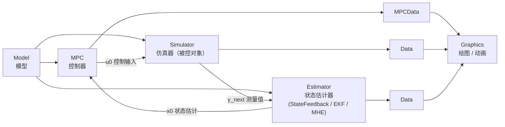

# do-mpc 项目 Wiki

> **do-mpc** —— 面向**非线性模型预测控制 (MPC)** 与**移动视界估计 (MHE)** 的开源 Python 工具箱

| 项目属性 | 值 |
|---|---|
| 当前版本 | `5.1.2`（见 [`do_mpc/_version.py`](../do_mpc/_version.py)） |
| 许可证 | GNU LGPL v3（见 [`LICENSE.txt`](../LICENSE.txt)） |
| 语言 / 运行时 | Python 3.x（CI 覆盖 3.10 / 3.11 / 3.12） |
| 核心依赖 | `casadi>=3.6.0`、`numpy`、`scipy`、`matplotlib`、`pandas` |
| 可选依赖 (`pip install do-mpc[full]`) | `torch>2.0.0`、`onnx>=1.13.0`、`asyncua`、`packaging`、`ipykernel` |
| 底层求解器 | IPOPT（NLP）、SUNDIALS CVODES/IDAS（积分） |
| 官方文档 | https://www.do-mpc.com |
| 源码仓库 | https://github.com/do-mpc/do-mpc |
| 维护方 | TU Dortmund 过程自动化系统实验室 (PAS) |

---

## 一、这个项目是做什么的？

**do-mpc** 让你用纯 Python + 符号表达式（CasADi）描述一个动态系统，然后自动完成：

1. **建模**：以 ODE / DAE / 差分方程的形式声明状态、输入、代数变量、参数；
2. **离散化**：用有限元上的正交配置法 (orthogonal collocation on finite elements) 把连续模型转成 NLP；
3. **求解**：调用 IPOPT 求解带约束的非线性规划；
4. **闭环**：MPC 控制器 → 仿真器 → 状态估计器 → 回到 MPC，滚动时域循环；
5. **鲁棒化**：通过"多阶段场景树 (multi-stage scenario tree)"显式处理参数不确定性；
6. **可视化 / 数据管理**：内置 Matplotlib 绘图、动画与 pickle 结果存取。

### 核心特性

- 非线性 MPC 与**经济型 (economic) MPC**
- 完整支持**微分代数方程 (DAE)**
- 有限元正交配置时间离散化
- **鲁棒多阶段 MPC**（场景树，`n_robust` 控制鲁棒时域深度）
- **移动视界状态与参数估计 (MHE)**、扩展卡尔曼滤波 (EKF)、状态反馈
- **LQR** 控制器（有限 / 无限时域），配套模型线性化与 DAE→ODE 转换工具
- **NLP 参数灵敏度微分**（`DoMPCDifferentiator`）
- **神经网络近似 MPC**（采样 → 训练 → 部署，`approximateMPC`）
- **OPC UA 实时接口**（可接入工业控制系统）
- **ONNX → CasADi** 转换（把训练好的神经网络嵌入模型）
- 模块化设计，易于扩展

---

## 二、控制闭环总览

do-mpc 的一切都围绕下面这张图展开：



对应的运行时代码只有三行（每个采样周期执行一次）：

```python
for k in range(n_steps):
    u0     = mpc.make_step(x0)         # 求解 OCP，返回第一步最优输入
    y_next = simulator.make_step(u0)   # 积分真实系统，返回测量值
    x0     = estimator.make_step(y_next)  # 由测量值估计下一时刻状态
```

---

## 三、仓库目录结构

```
do-mpc/
├── do_mpc/                     # ★ 库源码（安装后 import do_mpc 的内容）
│   ├── __init__.py             #   包入口：可选依赖探测 + 子模块导出
│   ├── _version.py             #   版本号
│   ├── _casadi_compat.py       #   CasADi 3.8 命名空间变更兼容层
│   ├── model/                  #   Model / LinearModel / linearize / dae2odeconversion
│   ├── optimizer.py            #   Optimizer 基类（MPC 与 MHE 共同父类）
│   ├── controller/             #   MPC / LQR + ControllerSettings
│   ├── estimator/              #   StateFeedback / EKF / MHE + EstimatorSettings
│   ├── simulator.py            #   Simulator + SimulatorSettings
│   ├── data.py                 #   Data / MPCData / save_results / load_results
│   ├── graphics.py             #   Graphics / default_plot / animate
│   ├── differentiator/         #   NLPDifferentiator / DoMPCDifferentiator
│   ├── approximateMPC/         #   ApproxMPC / Sampler / Trainer（需 torch）
│   ├── sampling/               #   SamplingPlanner / Sampler / DataHandler
│   ├── sysid/                  #   ONNXConversion / ONNXOperations（37 算子）
│   │                           #   + ann_to_dompc_model 声明式构建器（需 onnx）
│   ├── opcua/                  #   RTBase / RTServer / RTClient（需 asyncua）
│   └── tools/                  #   Timer / Structure / IndexedProperty / pickle 工具
├── examples/                   # ★ 21 组可直接运行的示例（见「示例导航」）
│   ├── ann_surrogate_model/    #   训练好的前馈网络 → do-mpc 模型 → MPC 闭环
│   └── lstm_surrogate_model/   #   LSTM 代理模型（手工翻译 + ONNX 两条路径）
├── documentation/              # Sphinx 文档源码（readthedocs 构建）
│   └── source/
│       ├── index.rst           #   文档首页
│       ├── getting_started.ipynb   # MPC 入门 Notebook
│       ├── mhe_example.ipynb       # MHE 入门 Notebook
│       ├── theory_mpc.rst / theory_mhe.rst / theory_orthogonal_collocation.rst
│       ├── FAQ.rst / installation.rst / Graphics.rst
│       └── example_gallery/    #   带讲解的示例 Notebook + 动图
├── testing/                    # ★ unittest 回归测试 + 参考结果 .pkl
├── .github/workflows/          # CI：pythontest.yml（测试）/ pythonpublish.yml（发布）
├── setup.py                    # 打包脚本
├── requirements*.txt           # 依赖清单（core / full / docs）
├── CITATION.cff                # 引用信息
└── README.md
```

---

## 四、Wiki 目录

| 页面 | 内容 | 适合谁 |
|---|---|---|
| [01 · 快速开始](01-快速开始.md) | 安装、环境准备、跑通第一个 MPC 闭环、四文件模板范式 | 第一次接触本项目 |
| [02 · 架构与核心概念](02-架构与核心概念.md) | 类继承关系、变量类型体系、连续/离散、SX/MX、TVP vs P、离散化与场景树原理 | 想理解设计思路 |
| [03 · 核心 API 参考](03-核心API参考.md) | 各模块类与方法的速查手册 | 日常开发查阅 |
| [04 · 配置参数速查](04-配置参数速查.md) | 所有 `settings` 字段、`bounds` / `scaling` / 目标函数 / 约束 API | 调参 |
| [05 · 进阶功能](05-进阶功能.md) | 鲁棒多阶段 MPC、近似 MPC、NLP 微分、采样工具、ONNX、OPC UA、LQR | 有特殊需求 |
| [06 · 示例导航](06-示例导航.md) | `examples/` 全部示例逐一说明 + Notebook 画廊 | 找参考代码 |
| [07 · 开发与测试](07-开发与测试.md) | 代码约定、测试机制、CI、文档构建、发布流程 | 贡献代码 |
| [08 · 常见问题与排错](08-常见问题与排错.md) | TVP 用法、可行性问题、IPOPT 静默、缩放、性能、踩坑记录 | 遇到报错 |
| [09 · 循环网络与自定义算子扩展](09-循环网络与自定义算子扩展.md) | LSTM/GRU 接入范式、37 个 ONNX 算子清单、`ann_to_dompc_model` 声明式构建器、**通用性边界实测**、如何新增算子、四层验证方法论、24 条踩坑清单 | 用神经网络建模 / 扩展 sysid |

---

## 五、30 秒速览：一个最小的 do-mpc 程序

```python
import do_mpc
import numpy as np

# 1) 建模
model = do_mpc.model.Model('continuous')
x = model.set_variable('_x', 'x')          # 状态
u = model.set_variable('_u', 'u')          # 输入
model.set_rhs('x', -x + u)                 # dx/dt = -x + u
model.setup()

# 2) 控制器
mpc = do_mpc.controller.MPC(model)
mpc.settings.t_step   = 0.1                # 采样周期（必填）
mpc.settings.n_horizon = 20                # 预测时域（必填）
mpc.set_objective(lterm=x**2, mterm=x**2)  # 阶段代价 + 终端代价
mpc.set_rterm(u=1e-2)                      # 输入增量惩罚
mpc.bounds['lower', '_u', 'u'] = -1
mpc.bounds['upper', '_u', 'u'] =  1
mpc.setup()

# 3) 仿真器（充当"真实对象"）
sim = do_mpc.simulator.Simulator(model)
sim.settings.t_step = 0.1
sim.setup()

# 4) 估计器（这里直接状态反馈）
est = do_mpc.estimator.StateFeedback(model)

# 5) 闭环
mpc.x0 = sim.x0 = np.array([[1.0]])
mpc.set_initial_guess(); sim.set_initial_guess()
for k in range(50):
    u0 = mpc.make_step(mpc.x0)
    y  = sim.make_step(u0)
    mpc.x0 = est.make_step(y)
```

---

## 六、引用

若在工作中使用了 do-mpc，请引用：

> F. Fiedler, B. Karg, L. Lüken, D. Brandner, M. Heinlein, F. Brabender and S. Lucia.
> **do-mpc: Towards FAIR nonlinear and robust model predictive control.**
> *Control Engineering Practice*, 140:105676, 2023.

完整 BibTeX / CFF 见 [`CITATION.cff`](../CITATION.cff)。同时请记得引用你使用的其他软件（CasADi、IPOPT 等）。

---

## 七、开发者与历史

- **最初开发**：Sergio Lucia、Alexandru Tatulea-Codrean（TU Dortmund DYN  chair，Sebastian Engell 领导）
- **后续维护**：Felix Brabender、Joshua Adamek、Felix Fiedler、Sergio Lucia（TU Dortmund [过程自动化系统实验室 PAS](https://pas.bci.tu-dortmund.de)）
- 版权年份跨度：2014 – 至今

---

*本 Wiki 由对项目源码的静态分析生成，覆盖版本 `5.1.2`。若源码更新，请以 `do_mpc/` 内的 docstring 与 https://www.do-mpc.com 为准。*
